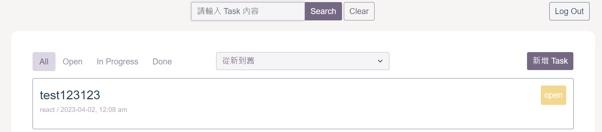

# GitHub API 串接

## 專案概述

串接 GitHub API，讓使用者能夠新增、更新、搜尋以及刪除 Issue

## 網頁預覽


   

>*此專案包含前後端，且在本地端( localhost )才能執行。

## 網站頁面

1. GitHub Login : 使用者登入後有權限操作 GitHub API。
2. Task 列表頁 : 第一次載入 10 筆資料，滾到底額外載入 10 筆，且可依照使用者需求進行 Task 篩選、排序、搜尋以及新增。 
3. Task 詳情頁 : 顯示 Task 的標題、內容、狀態以及 labels，使用者可以在此進行編輯或刪除。

## 安裝方式

在 GitHub 建立 OAuth Apps，將 Homepage URL 設定為 http://localhost:3000，Authorization callback URL 設定為 http://localhost:3000。

完成後分別在前後端安裝 modules。

```
yarn install
```
或
```
npm install
```

## 環境變數

在前後端根目錄分別新增 .env 檔案，並複製 .env.example 內容，輸入 GitHub OAuth Apps 提供的 Client ID 以及 Client secrets。

## 啟動方式

> _安裝前先確認 node 版本號，建議使用 v18.12.1 以上版本。_  
> _前端頁面會在 localhost:3000 執行，後端則可以在 3001 port 查看 api 內容。_

#### 前端使用

```
yarn start
```
或
```
npm start
```

#### 後端使用
```
node server.js
```

## 專案使用技術

### 前端

- React
- Bootstrap5
- Sass

### 後端

- nodeJS
- express

### 使用套件

- axios
- eslint
- prettier
- moment
- react-bootstrap
- react-markdown
- react-router
- web-vitals
